# 📅 ScheduleMyClass - 你的本地隐私课表

[](https://opensource.org/licenses/MIT)


一个现代、极简且注重隐私的课程表管理工具。不需要注册账号，不需要下载 App，支持多端打开，**所有数据仅保存在你的浏览器本地**。

支持多学期管理、时间冲突自动排版、手机端完美适配，以及**一键导出到苹果/谷歌日历**。

**这不仅仅是一个排课工具，更是建立规律生活的 Weekly Routine 规划神器！**
无论你是需要安排学期课程的大学生，还是想要固定健身、阅读、冥想时间的“自律达人”，它都能帮你把一周安排得明明白白。

### 🚀 [点击这里直接开始使用](https://wyf02.github.io/ScheduleMyClass/)

---

## ✨ 核心亮点

* 🧘 **规律生活 (New)**：专为**建立 Weekly Routine** 设计。不仅适用于排课，也能完美规划“早八晨读”、“周三健身”、“周五复盘”等固定生活节奏。**J人狂喜！**
* 🔒 **隐私安全**：数据存储在本地 (LocalStorage)，不上传服务器(纯前端......作者不想要弄任何数据库也不想要接收任何人的数据)。
* 📱 **手机适配**：精心设计的响应式布局，支持“抽屉式”列表和横向滑动视图，手机操作顺滑。
* ⚡ **智能排版**：当两门课程时间重叠时，自动左右分栏显示，拒绝遮挡。
* 🗓️ **日历同步**：支持生成 `.ics` 文件，将整学期课程一键导入 iPhone/Android 日历。
* 💾 **数据迁移**：支持导出 JSON 备份文件，在不同设备间无缝切换。
* 💾 **AI协作**：针对部分固定日程，建议可以先让市面上的AI读取您的excel、pdf 生成固定格式的JSON文件，直接导入课表。
---

## 📸 功能演示

### 1. 清晰的周视图 (Desktop)
在大屏幕上，课程表一目了然。支持时间冲突检测，多门课重叠时会自动并排显示。
左侧时间轴和顶部星期表头支持 **“冻结窗格”**，滚动查看时永远不迷路。

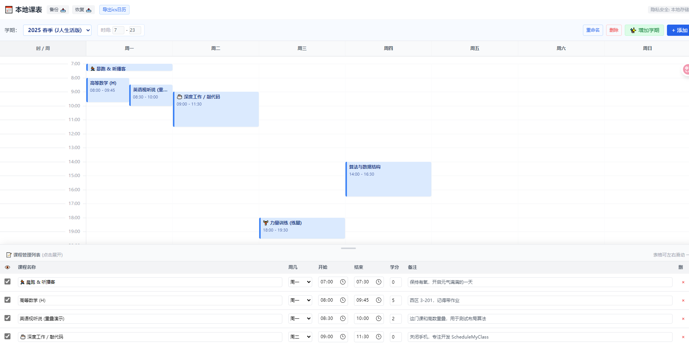

### 2. 完美的手机体验 (Mobile)
在手机上，底部列表采用 **“抽屉式”设计**。点击标题栏即可展开编辑，再次点击收起以查看课表。
表格支持横向滑动，并在超小屏幕上自动优化按钮布局。

<p align="center">
  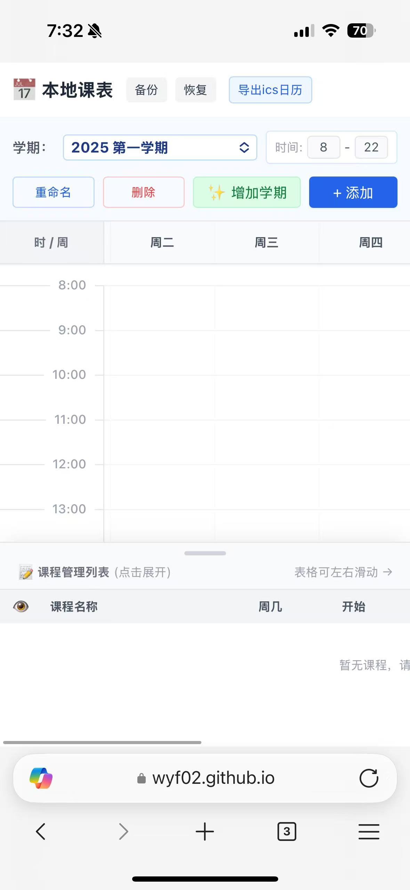
  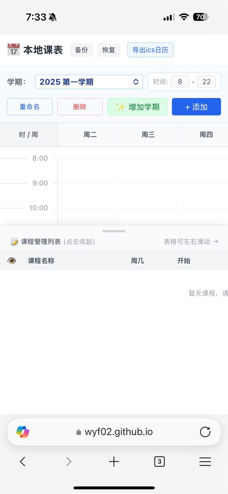
  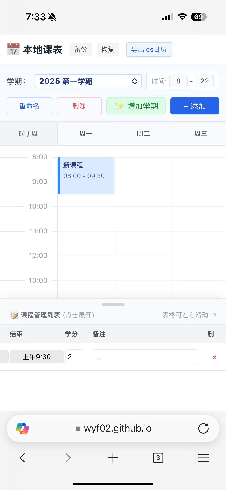
  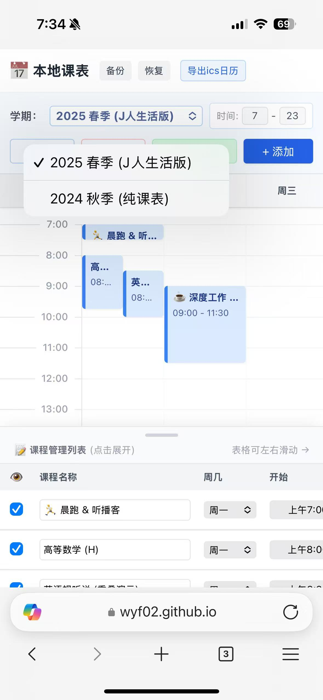
</p>
---

## 📖 使用教程

### 第一步：添加课程/日程
1. 点击右上角的 **“+ 添加”** 按钮。
2. 在底部的列表中输入名称（如“高等数学”或“力量训练”）、周几、开始结束时间，支持note项（比如 课程序号、教室位置、授课老师、想对自己说的话等任何备注）
3. **支持直接输入时间**（如 08:00），系统会自动生成可视化色块。
4. 可以选择不显示/显示，还是直接删除。
5. 不需要保存按钮，输入即自动保存。

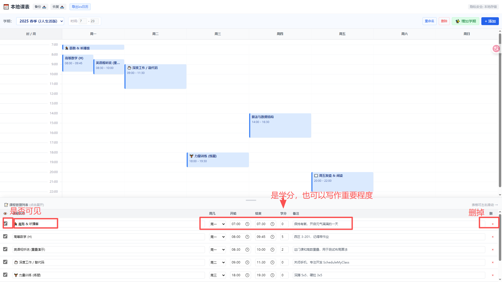

### 第二步：导入到手机日历 (强烈推荐!)
想在手机自带的日历里看到课程，并收到上课提醒？
1. 点击顶部的 **“🗓️ 日历”** 按钮。
2. 输入本学期/本次规划 **第一周的周一** 和 **最后一周的周日** 日期。
3. 系统会自动生成 `.ics` 文件。
4. **iPhone 用户**： 目前手机端我没有找到好的方式去引入ics,目前看来只能你给自己的邮箱发邮件，把ics文件作为附件发过去，然后你在手机上接收它，它才会被添加到你的日历。 mac端直接下载文件拖拽到日历就行。

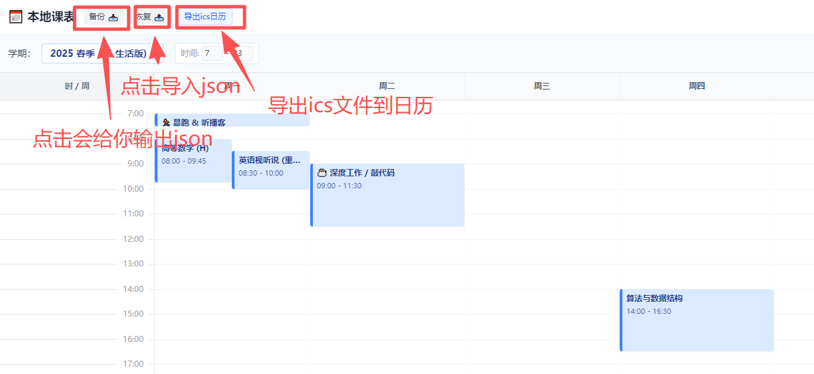
<p align="center">
  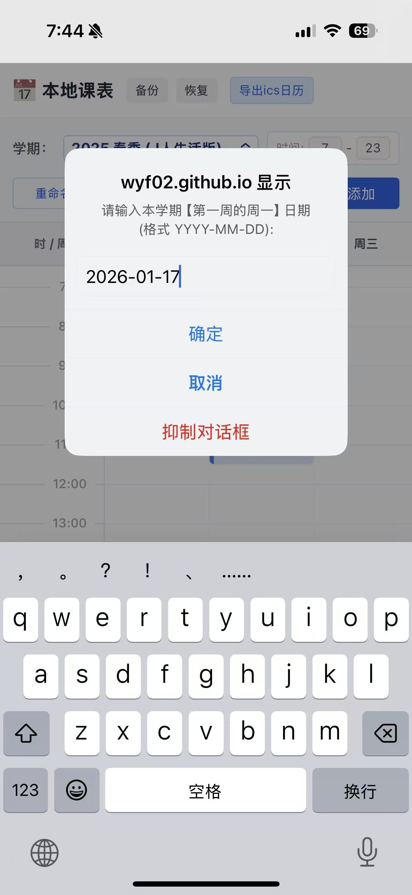
  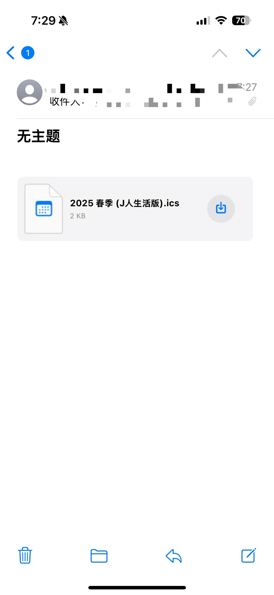
  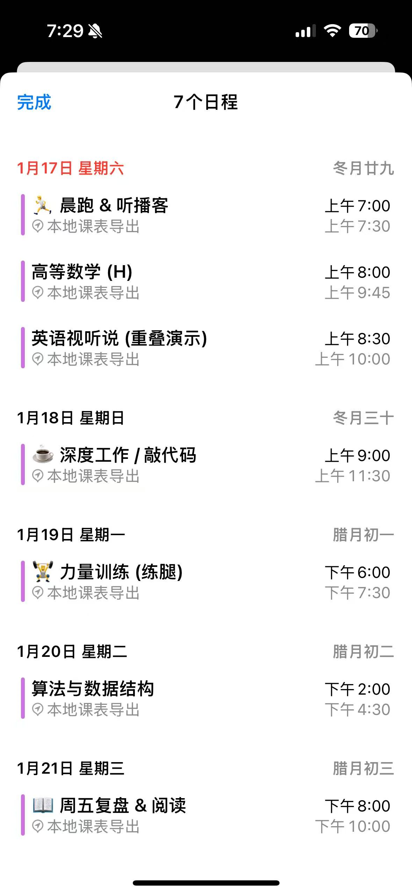
  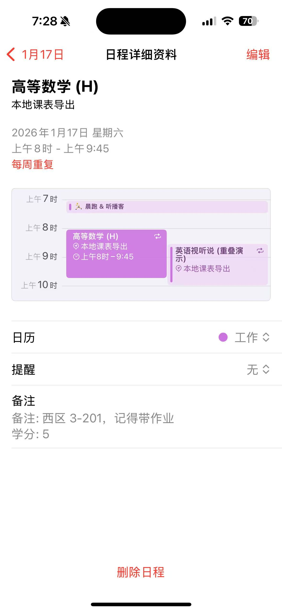
   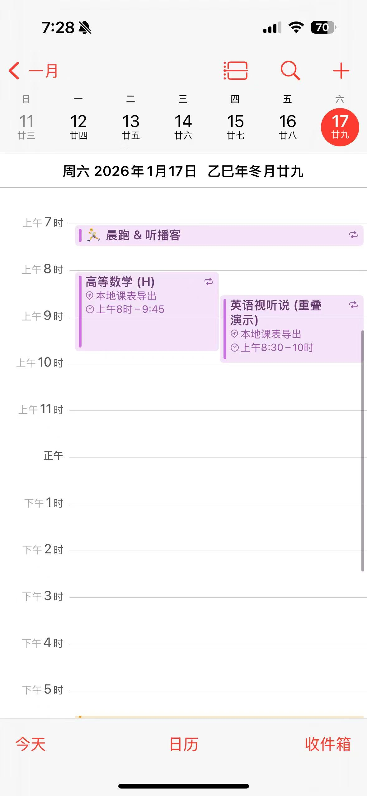
</p>

### 第三步：数据备份
**⚠️ 注意：清理浏览器缓存会丢失数据！**
建议定期点击 **“备份📥”** 按钮下载 JSON 文件。换电脑时，点击 **“恢复📤”** 导入JSON即可还原所有数据。

---

### 可选：AI协作
可自行撰写提示词，并向您常用的AI发送您的pdf安排文档，让它以如下形式输出

### 提示词示例：
# Role
你是一个专业的课程表数据转换助手。你的任务是提取我提供的课程表文件（PDF/图片/文本）中的信息，并将其转换为特定的 JSON 格式。

# Goal
输出一个符合下方定义的 JSON 数据，可以直接用于 "ScheduleMyClass" 应用程序导入。

# JSON Structure Definition
请严格遵守以下 JSON 结构（包含学期信息和课程列表）：

```json
[
  {
    "id": "generate_unique_string_id", // 随机生成的唯一字符串
    "name": "2025 春季学期", // 根据文件内容推断学期名称，若未知则使用默认值
    "startHour": 8, // 视图默认开始时间 (通常为8)
    "endHour": 22, // 视图默认结束时间 (通常为22)
    "courses": [
      {
        "id": "generate_unique_string_id", // 随机生成的唯一字符串
        "name": "课程名称",
        "day": 1, // 1=周一, 2=周二, ..., 7=周日
        "startHour": 8.0, // ⚠️ 重要：必须转换为十进制小时 (例如 8:30 = 8.5, 9:45 = 9.75)
        "endHour": 9.75, // ⚠️ 重要：必须转换为十进制小时
        "credit": 2, // 学分，如果没有则填 0
        "serialNumber": "CS101", // 课程代码，如果没有则留空
        "notes": "教室: 3-201, 教师: 王教授", // 将教室、教师等额外信息放入备注
        "isVisible": true // 默认为 true
      }
      // ... 更多课程
    ]
  }
]
``` 

---

## 🛠️ 技术栈

* **Core**: React + TypeScript + Vite
* **Styling**: Tailwind CSS
* **Logic**: 纯前端架构 (No Backend)
* **Library**: `ics` (用于生成日历文件)

## 🤝 贡献与反馈

如果你有好的更多功能建议或发现了 Bug，欢迎提交 Issue 或 Pull Request。

如果这个小工具帮到了你，麻烦给个 ⭐ Star 喽！

---

Made with ❤️ by [Yifan Wang](https://wyf02.github.io/#/) and [Gemini](https://gemini.google.com/)